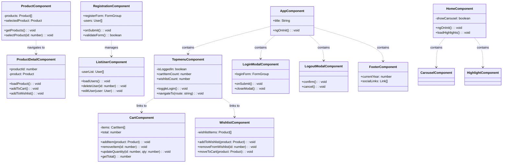

# H&M Corporate Website Clone

A feature-rich e-commerce platform built with Angular 17, implementing modern web development practices and comprehensive shopping functionalities.

## Project Overview

This project is a sophisticated clone of the H&M corporate website, built using Angular 17 and incorporating advanced features for a complete e-commerce experience. The application demonstrates best practices in modern web development, robust state management, and secure user authentication.

## Features

### Core Functionality
- Product browsing and detailed views
- Shopping cart management
- Wishlist functionality
- User registration and authentication
- Responsive design for all devices

### Technical Implementation

#### Angular Framework Features
- Standalone Components architecture
- Dependency Injection system
- Two-way Data Binding
- Component Lifecycle Hooks
- Services and Observables
- Reactive Forms
- Custom Directives

#### State Management
- RxJS BehaviorSubjects
- Observable Streams
- Service-based State
- Session Management
- Local Storage Integration
- Data Persistence
- Event Broadcasting

#### Security Implementation
- User Authentication Flow
- Route Guards
- Form Validation
- Session Handling
- Error Management
- Data Encryption
- Secure API Calls

#### UI/UX Features
- Angular Material Components
- Responsive Design
- Dynamic Modal System
- Interactive Navigation
- Form Validation

## Class Diagram



## Project Structure

```
src/
├── app/
│   ├── features/
│   │   ├── home/
│   │   │   ├── carousel/
│   │   │   └── highlight/
│   │   ├── product/
│   │   │   └── productdetail/
│   │   └── notfound/
│   ├── shared/
│   │   └── components/
│   │       ├── cart/
│   │       ├── footer/
│   │       ├── loginmodal/
│   │       ├── logoutmodal/
│   │       ├── registration/
│   │       ├── topmenu/
│   │       └── wishlist/
│   ├── app.component.ts
│   ├── app.routes.ts
│   └── app.config.ts
├── assets/
└── styles.css
```

## Routing Structure

The application implements a comprehensive routing system:

- `/home` - Main landing page with carousel and highlights
- `/product` - Product listing page
- `/productdetail/:id` - Individual product details
- `/registration` - User registration
- `/wishlist` - User's wishlist
- `/cart` - Shopping cart
- `/listuser` - User management (admin)

## Dependencies

### Main Dependencies
- Angular v18.2.0
- Angular Material v18.2.11
- Bootstrap v5.3.3
- RxJS v7.8.0
- Express v4.18.2

### Development Dependencies
- Angular CLI v18.2.7
- TypeScript v5.5.2
- Karma v6.4.0 (Testing)
- Jasmine v5.2.0 (Testing)

## Available Scripts

- `npm start` - Starts development server
- `npm run build` - Builds the application
- `npm run watch` - Builds in watch mode
- `npm test` - Runs unit tests
- `npm run serve:ssr` - Serves server-side rendered application

## License

Copyright (c) 2024 Claudia Souza
